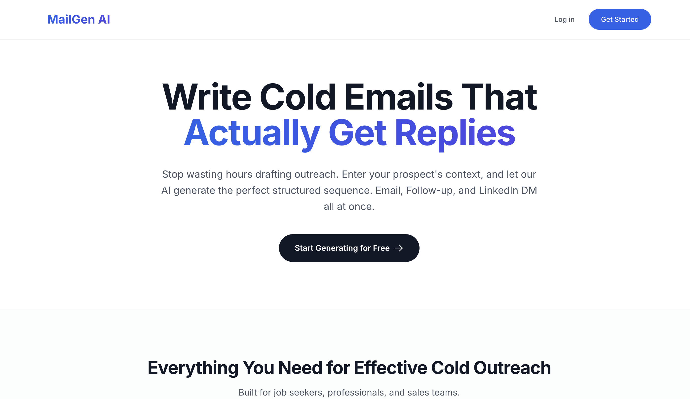
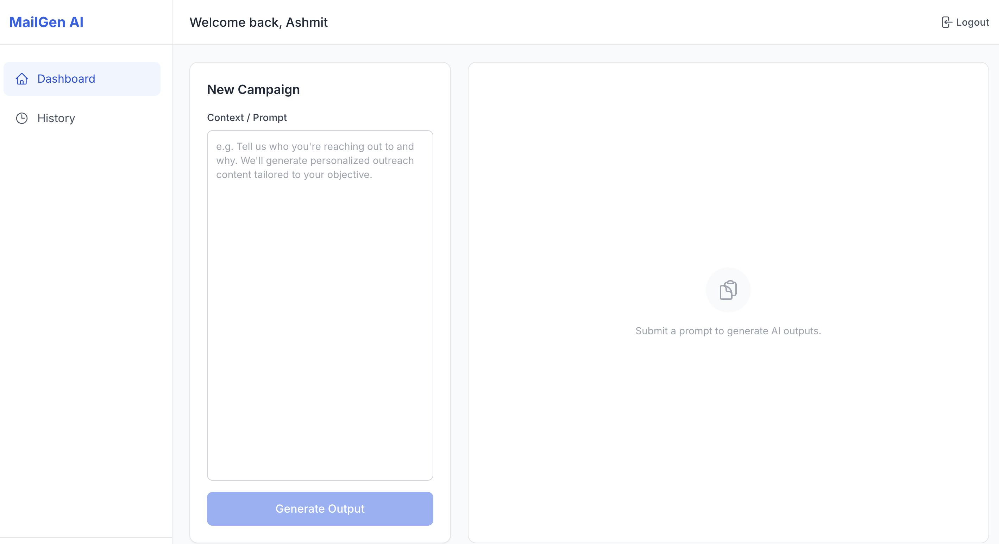
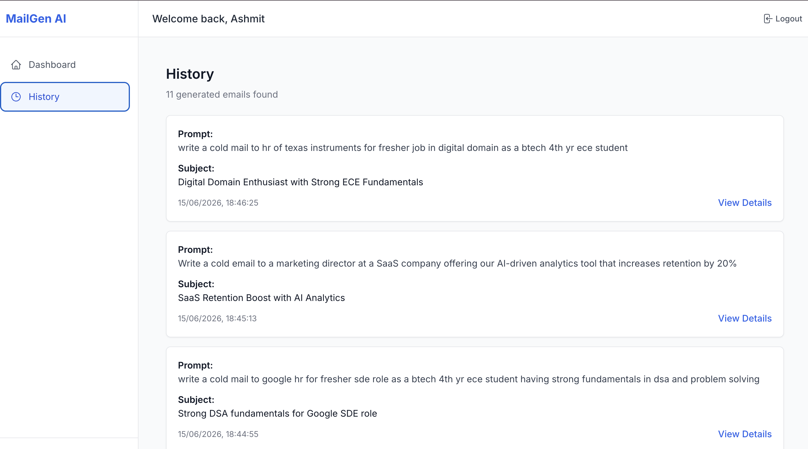

# MailGen AI – AI-Powered Cold Email Generator

## Overview

MailGen AI is a full-stack web application that helps users generate personalized outreach campaigns using AI. Instead of spending time drafting cold emails manually, users can provide a simple prompt and instantly generate a complete outreach sequence, including a cold email, LinkedIn message, and follow-up email.

The application also maintains a history of generated campaigns, allowing users to revisit and reuse previous outreach content.

### Live Demo


Application: https://ai-cold-mail-generator-d2yp.onrender.com


---

## Problem Statement

Writing personalized cold outreach is repetitive and time-consuming. Generic templates often lead to poor engagement, while creating customized messages for every opportunity requires significant effort.

MailGen AI streamlines this process by generating structured outreach content tailored to the user's input, helping reduce drafting time while maintaining professional communication quality.

---

## Key Features

### AI-Powered Outreach Generation

Generate a complete outreach sequence from a single prompt:

- Cold Email
- LinkedIn Direct Message
- Follow-Up Email

### Secure Authentication

- User Registration and Login
- JWT-based Authentication
- Protected Routes
- Persistent User Sessions

### Campaign History

- Stores generated campaigns in MongoDB
- View previous generations
- Access outreach history across sessions

### Responsive Dashboard

- Clean and intuitive user interface
- Real-time content generation
- Dedicated history management page

---

## Tech Stack

### Frontend

- React.js
- Vite
- Tailwind CSS
- React Router
- Axios

### Backend

- Node.js
- Express.js
- REST APIs

### Database

- MongoDB Atlas
- Mongoose

### Authentication

- JWT (JSON Web Tokens)
- bcrypt

### AI Integration

- Groq API
- Llama 3.3 70B Model

### Deployment

- Render
- MongoDB Atlas

---

## Architecture

```text
React Frontend
       │
       ▼
Express Backend
       │
 ┌─────┴─────┐
 ▼           ▼
MongoDB    Groq AI
 Atlas
```

The frontend communicates with the Express backend through REST APIs. The backend handles authentication, prompt processing, AI generation requests, and storage of generated campaigns in MongoDB.

---

## Engineering Challenges Solved

- Integrated a large language model to generate structured outreach content in multiple formats.
- Improved AI response quality through prompt engineering and contextual guidance.
- Implemented JWT-based authentication and protected routes.
- Built campaign history storage and retrieval using MongoDB.
- Managed frontend-backend communication across separate cloud deployments.
- Resolved production deployment issues including CORS configuration, environment variables, and API connectivity.

---

## Future Improvements

- Industry-specific outreach templates
- Campaign export functionality
- Multi-language email generation
- Analytics dashboard
- User customization and tone controls
- Team collaboration features

---

## Screenshots

### Landing Page



### Dashboard



### History Page



---

## Author

**Ashmit Garg**

GitHub: https://github.com/Ashmit-104